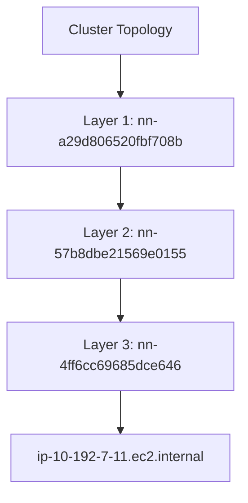

# Cluster Topology Visualization

Visualizes the inter-node network topology of a SageMaker HyperPod EKS cluster using Kubernetes `topology.k8s.aws/network-node-layer-*` labels. Outputs a [Mermaid](https://mermaid.js.org/) flowchart to stdout and generates an HTML file for local viewing.

## Prerequisites

- `kubectl` configured for your HyperPod EKS cluster
- `jq` installed
- Cluster must contain at least one node with a supported instance type

## Supported Instance Types

| Family | Instance Types |
|--------|---------------|
| P4 | `ml.p4d.24xlarge`, `ml.p4de.24xlarge` |
| P5 | `ml.p5.48xlarge`, `ml.p5e.48xlarge`, `ml.p5en.48xlarge` |
| P6 | `ml.p6e-gb200.36xlarge`, `ml.p6-b200.48xlarge` |
| Trn1 | `ml.trn1.2xlarge`, `ml.trn1.32xlarge`, `ml.trn1n.32xlarge` |
| Trn2 | `ml.trn2.48xlarge`, `ml.trn2u.48xlarge` |

Nodes with unsupported instance types (e.g., `t3.medium`) are automatically skipped.

## Usage

```bash
bash visualize_topology.sh
```

## Output

1. Mermaid flowchart printed to stdout
2. `topology.html` generated in the current directory — open in a browser to view

### Example Mermaid Output


